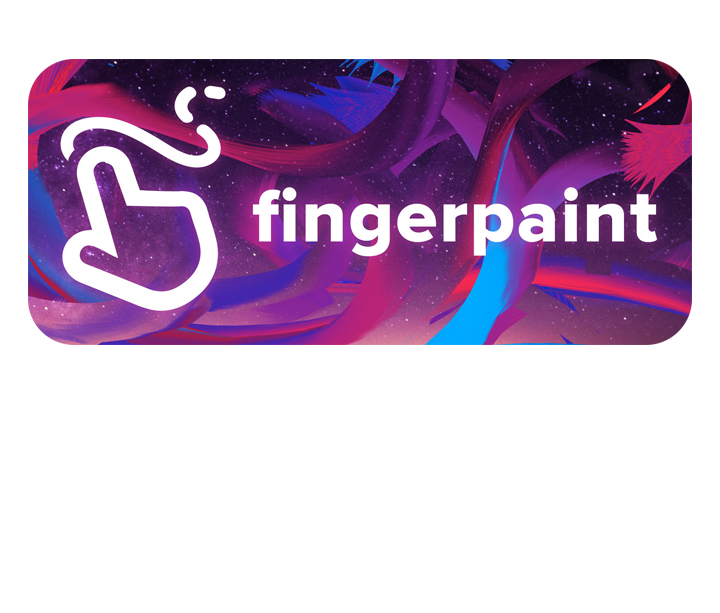

###  fingerpaint
fingerpaint utilizes OpenCV to perform visual image processing on a webcam video stream in real time to create an interactive whiteboarding application.

### Usage

`pip install -r requirements.txt`
`python drawing.py`

Calibrate desired Object in designated area with green rectangles and press 'z' to move forward to the Canvas. From there, you can use the Object to control your cursor and draw on the Canvas without any touch screen technology needed.